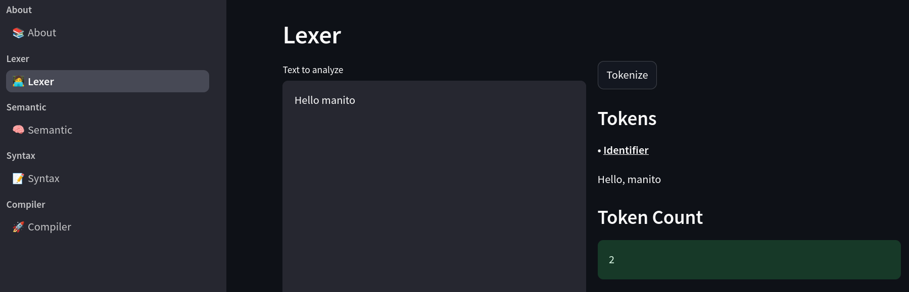

---
title:
- "Lexer"
author:
- \textsc{Enrique Calderón} \newline
- \textsc{Luis Salazar} \newline
- \textsc{Hansel Tepal} \newline
- \textsc{Luis Ugartechea} \newline
institute:
- \textit{Universidad Nacional Autónoma de México\\ Facultad de Ingeniería}
date:
- March 18, 2025
---

# Introduction

Our lexical analyzer follows the KISS principle, as you would expect for a software implementation. As we know the process is essential for the compiler to work, we need to take into consideration that this should reduce future problems during the next steps of analysis.

# Rules for the lexer

In order to design and implement a lexical analyzer we should be able to identify tokens, which are the smallest unit of a program. Each token most follow a grammatical rule depending on his type, for the output we will classify the tokes and print the total amount for the lexem input.

# Implementation logic

Based on the rules previously defined for the lexer we decided to classify the tokens in the following categories:

- **Keywords**: Reserved words that have a special meaning in the language.
- **Identifiers**: A sequence of characters that represent a name.
- **Operators**: Symbols that represent an operation.
- **Constants**: A value that does not change during the execution of a program.
- **Punctuation**: Symbols that are used to separate or group expressions.
- **Literals**: A sequence of characters that represent a value.
- **Comments**: A sequence of characters that are not interpreted by the compiler.

# Order matters

The code was implemented in python using the `re` library to match the tokens with the regular expressions.

We faced some problems related to the order of the regular expressions, so we decided to follow the next order:

1. **Comments**: Start with the comments because they are the easiest to identify.
2. **Literals**: Otherwise they could be confused with the keywords or identifiers.
3. **Keywords**: The most important part of the code.
4. **Identifiers**: Most common part of the code.
5. **Constants**: If they are not identified as identifiers.
6. **Operators**: The last part of the code that is not alphanumeric and mean something.
7. **Punctuation**: The organization of the code.

# Code implementation

To maintain the code clean we decided to use OOP, so we created a class for the lexer with methods such as:

- `tokenize`: To classify the tokens. It returns a dictionary with the tokens of the input.
- `token_count`: To count the total amount of tokens. It returns the total amount of tokens.
